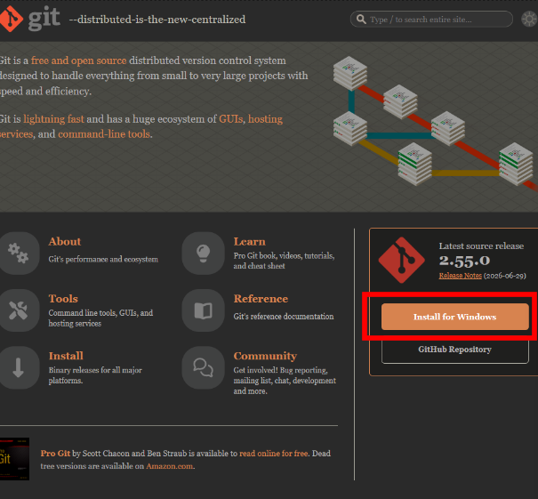
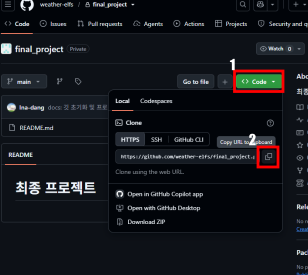
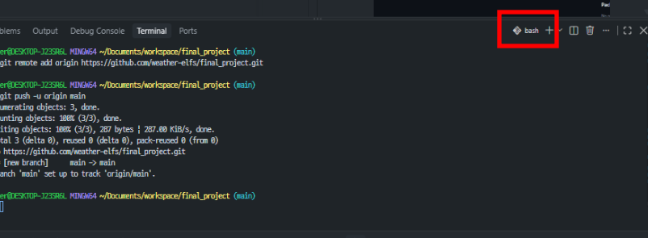
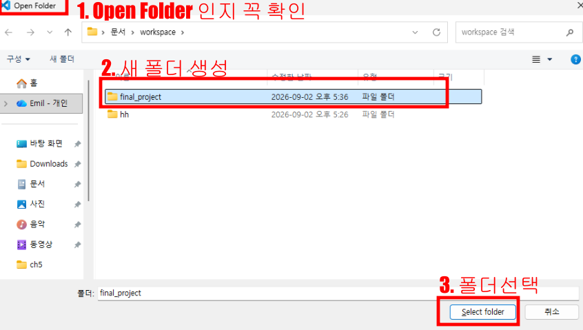

# 최종 프로젝트

> 깃 초기화 및 깃 기본 학습용 리드미  
> 주제 정해지고 나면 다시 수정 할 예정

## 주제: 빅데이터 기반의 국방 기상데이터 분석 시스템 개발

키워드: 가시도(안개, 습도, 미세먼지 등등)

- [figjam](https://www.figma.com/board/bjllnWtHwHH2VdgdkcXl5T/%EC%B5%9C%EC%A2%85?node-id=1-754&t=tyPIqYALkTtN42ga-0)

---

## 깃 기본세팅 & 프로젝트 가져오기 (하다가 모르겠으면 바로 물어보세여~~~~~~~)

### 1. [git 다운로드](https://git-scm.com/) ← 링크 클릭



- 설치 파일 다운로드 후 git 설치

### 2. [깃허브 레포지토리 접속](https://github.com/weather-elfs/final_project) ← 링크 클릭



- 초록색 코드 버튼 선택
- 복사 아이콘 클릭

### 3. VSCode 열기

### 4. [기본터미널 bash로 변경](https://serene-r.tistory.com/38) ← 링크 클릭하여 안내대로 VSCode 기본 터미널 변경

### 5. VSCode 재시작 후 `Ctrl + J` 눌러서 기본 터미널 bash로 바뀌었는지 확인



- 안바뀌었으면 휴지통 모양 아이콘 한번 누르고 다시 `Ctrl + J`

### 6. 프로젝트 진행할 폴더 생성 후 `Ctrl + K, Ctrl + O` 눌러서 Open Folder 팝업 활성화



### 7. 폴더 선택후 터미널에 아래와 같이 명령어 순차적으로 입력

```bash
# 해당 폴더에서 사용할 Git 이메일 계정등록
git config --local user.email "본인이메일주소"

# Git 커밋시 사용할 닉네임 등록
git config --local user.name "닉네임"

# 레포지토리에서 프로젝트 복제 (뒤에 . 빼먹지말기)
git clone https://github.com/weather-elfs/final_project.git .
```

### 프로젝트 복사 확인 후 완료 됐다고 알려주세요~~~~~~~~~~~~~~
